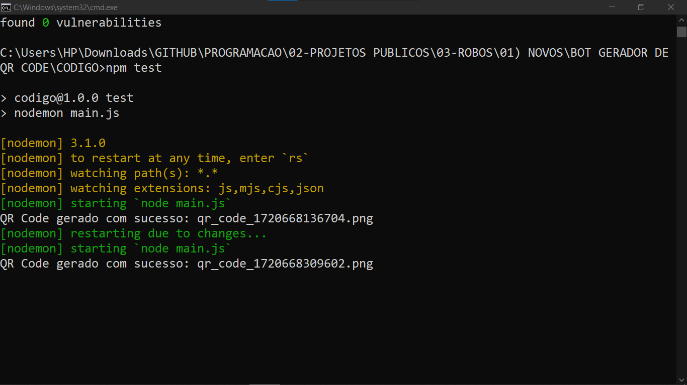

# BOT GERADOR DE QR CODE
🤤ESTE BOT TELEGRAM FOI DESENVOLVIDO PARA GERAR QR CODES A PARTIR DE TEXTOS ENVIADOS PELOS USUÁRIOS.

 <br>
 <br>

## DESCRIÇÃO:
Este bot Telegram foi desenvolvido para gerar QR Codes a partir de textos enviados pelos usuários. Ele utiliza a biblioteca `Telegraf` para interagir com a API do Telegram e `qrcode` para gerar os QR Codes. 

## FUNCIONALIDADES:
1. **Comando /start:**
   - Ao iniciar o bot, o usuário recebe uma mensagem de boas-vindas com instruções para enviar um texto.
   - Exemplo: "Olá! Envie o texto para gerar um QR Code."

2. **Receber Texto:**
   - Quando o usuário envia um texto, o bot gera um QR Code correspondente ao texto recebido.
   - O QR Code gerado é temporariamente salvo como uma imagem PNG com um nome único baseado na data e hora do envio.
   
3. **Enviar QR Code:**
   - Após gerar o QR Code, o bot responde ao usuário enviando a imagem do QR Code.
   - A imagem é enviada como resposta à mensagem do usuário.

4. **Tratamento de Erros:**
   - Caso ocorra algum erro durante o processo de geração do QR Code, o bot envia uma mensagem de erro ao usuário.
   - Os erros são registrados no console para fins de depuração.

## EXECUTANDO O PROJETO:
1. **Editar o código:**
   - Certifique-se de substituir "seu_token_aqui" pelas informações corretas das suas credenciais em `CODIGO/.env`, o qual pode ser obtido por meio do [@BotFather](https://t.me/BotFather).

2. **Instalando as Depêndencias:**
   - Para instalar as dependências listadas no arquivo "package.json", você pode usar o comando `npm install` no terminal. Certifique-se de estar no diretório do seu projeto onde o arquivo "package.json" está localizado (`CODIGO`). O npm irá ler o arquivo "package.json" e instalar todas as dependências listadas nele. 

   ```bash
   npm install
   ```

3. **Inicie o Bot:**
   - Para usar o `NODE`, inicie o bot com o seguinte comando:
    ```bash
    npm start
    ```

    - Para usar o `NODEMON`, inicie o bot com o seguinte comando:
    ```bash
    npm test
    ```

4. **Interagindo com o Bot:**
   1. **Iniciar o Bot:**
      - Inicie o bot no Telegram enviando o comando `/start`.

   2. **Enviar Texto:**
      - Após iniciar o bot, envie um texto que você deseja transformar em QR Code.
      - O bot processará o texto e responderá com a imagem do QR Code correspondente.

   3. **Receber QR Code:**
      - Após enviar o texto, aguarde o bot processar e responder com a imagem do QR Code.
      - Você pode salvar ou compartilhar a imagem do QR Code conforme necessário.

## NÃO SABE?
- Entendemos que para manipular arquivos em muitas linguagens e tecnologias relacionadas, é necessário possuir conhecimento nessas áreas. Para auxiliar nesse aprendizado, oferecemos cursos gratuitos disponíveis:
* [CURSO DE TELEGRAF](https://github.com/VILHALVA/CURSO-DE-TELEGRAF)
* [CURSO DE JAVASCRIPT](https://github.com/VILHALVA/CURSO-DE-JAVASCRIPT)
* [CURSO DE NODEJS](https://github.com/VILHALVA/CURSO-DE-NODEJS)
* [CONFIRA MAIS CURSOS](https://github.com/VILHALVA?tab=repositories&q=+topic:CURSO)

## CREDITOS:
- [PROJETO BASEADO NO "GERADOR DE QR CODE"](https://github.com/VILHALVA/GERADOR-DE-QR-CODE)
- [PROJETO FEITO PELO VILHALVA](https://github.com/VILHALVA)

